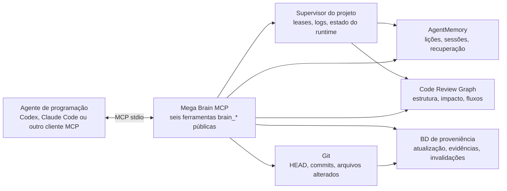
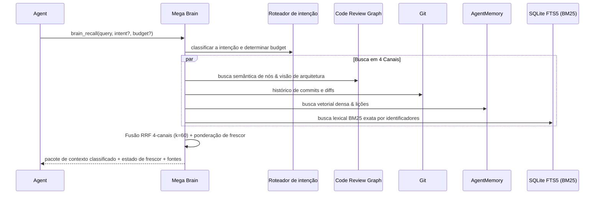
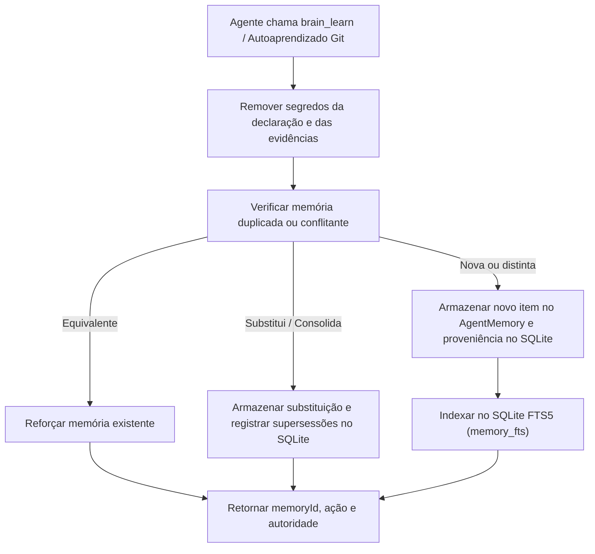
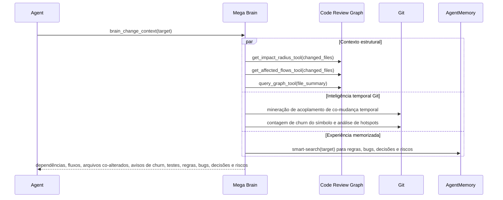
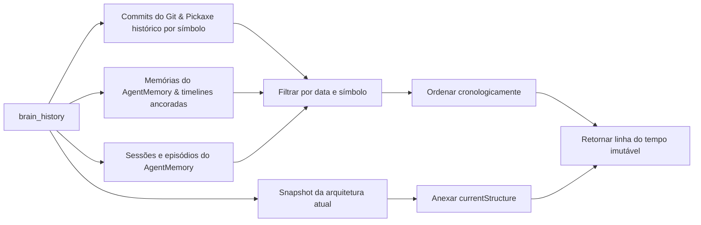
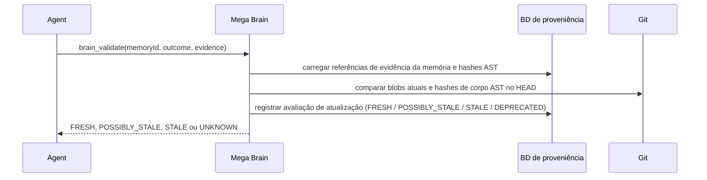
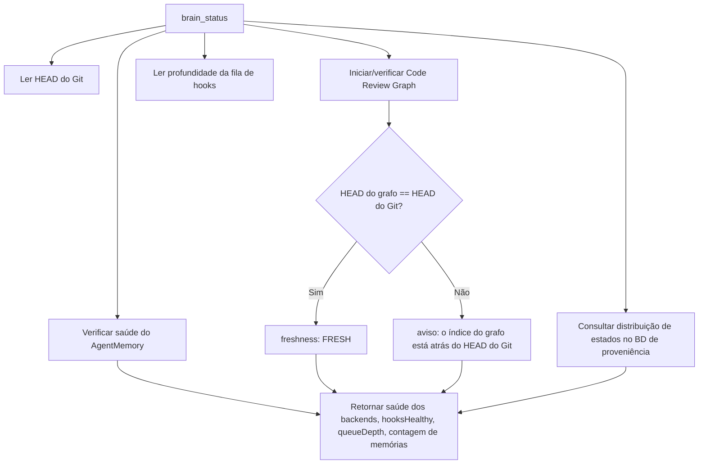
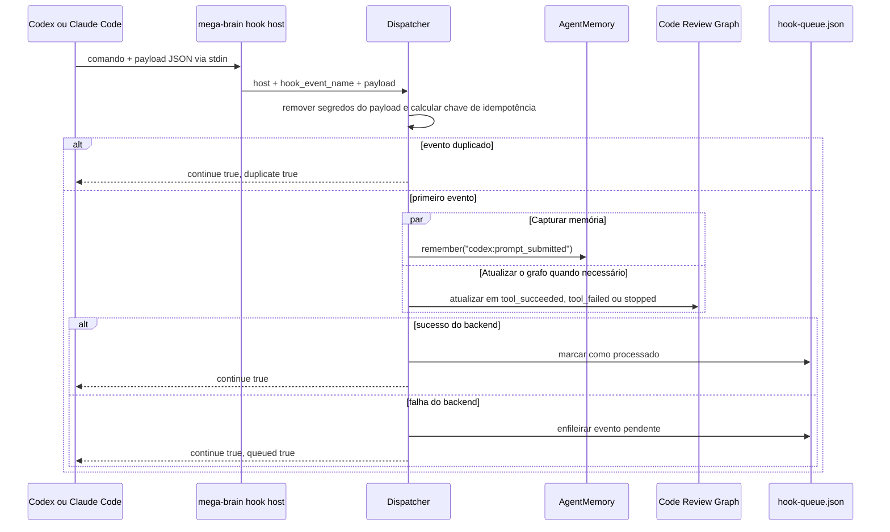
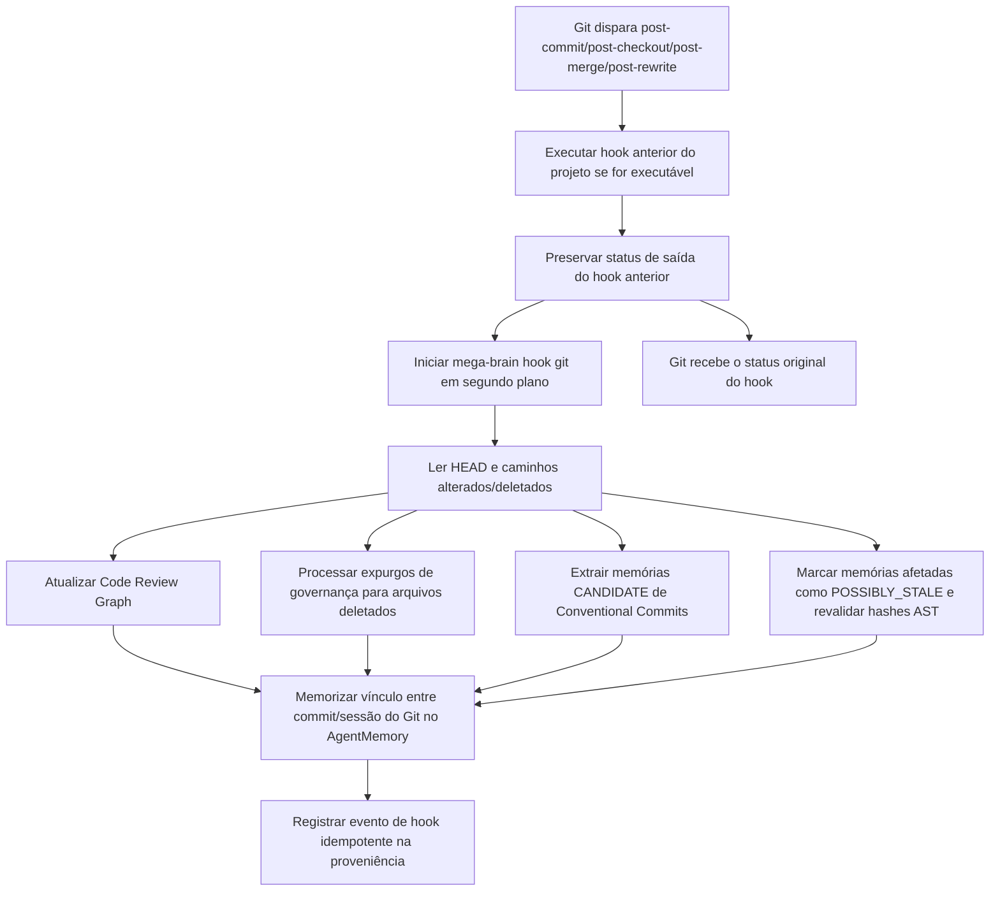
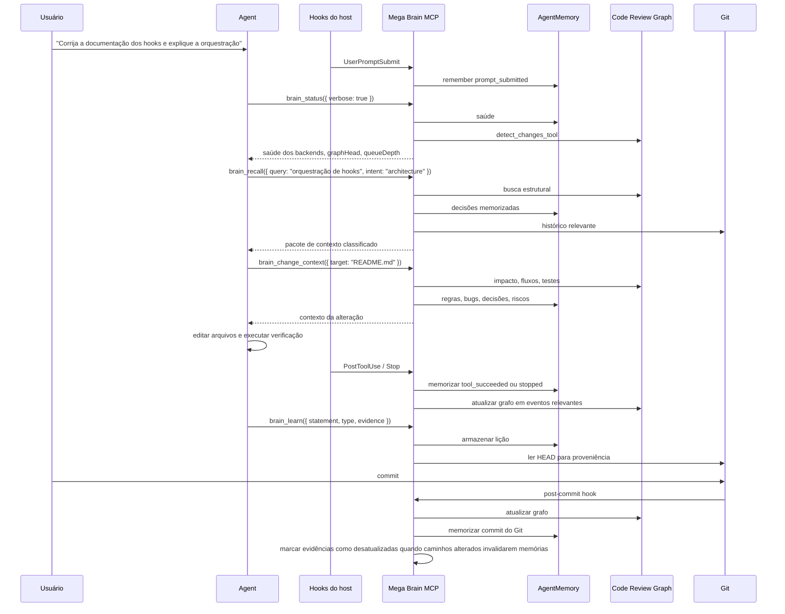

# Mega Brain MCP

Mega Brain MCP é um plano de controle de conhecimento local-first para projetos de software. Ele expõe seis ferramentas MCP estáveis, mantendo AgentMemory, Code Review Graph e Git por trás de adaptadores privados versionados.

A interface MCP pública é composta exatamente por `brain_recall`, `brain_learn`, `brain_change_context`, `brain_history`, `brain_validate` e `brain_status`.

> [!NOTE]

> Os agentes se comunicam com um único servidor Mega Brain MCP. Eles não chamam AgentMemory ou Code Review Graph diretamente. O Mega Brain é responsável por roteamento, proveniência, atualização, hooks, enfileiramento e isolamento dos backends.

## Conteúdo

- [Requisitos](#requisitos)

- [Instalar o pacote](#instalar-o-pacote)

- [Configurar um projeto](#configurar-um-projeto)

- [O que é instalado por projeto](#o-que-é-instalado-por-projeto)

- [Arquitetura de runtime](#arquitetura-de-runtime)

- [Ferramentas MCP](#ferramentas-mcp)

- [Hooks](#hooks)

- [Exemplo de sessão do agente](#exemplo-de-sessão-do-agente)

- [Usar e verificar](#usar-e-verificar)

- [Precedência de configuração](#precedência-de-configuração)

- [Desenvolvimento e gates isolados de release](#desenvolvimento-e-gates-isolados-de-release)

## Requisitos

- Node.js `>=22.22.0` (certificado nas versões 22.22.0 e 24.19.0)

- Python `>=3.10` com `venv` e `ensurepip`

- Git executável para evidências, histórico e instalação de hooks baseados em Git

- Windows, Ubuntu ou WSL

Um diretório não precisa estar inicializado como repositório Git apenas para iniciar a CLI. Quando `.git` não existe, o Mega Brain deriva uma identidade estável para o diretório, configura os componentes de MCP/runtime que não dependem do Git e informa hooks, histórico e evidências de commit baseados em Git como indisponíveis até que o projeto seja inicializado.

`mega-brain setup` verifica os pré-requisitos obrigatórios do runtime antes de criar arquivos de runtime, baixar backends ou alterar a configuração do host. A ausência do Git é informada como indisponibilidade, em vez de bloquear a inicialização. Em seguida, o modo gerenciado instala as versões gerenciadas padrão do AgentMemory, do Code Review Graph e, no Windows, do iii-engine, exceto quando sobrescritas por `MEGA_BRAIN_AGENTMEMORY_VERSION`, `MEGA_BRAIN_CODE_REVIEW_GRAPH_VERSION` ou `MEGA_BRAIN_III_ENGINE_VERSION`, em um runtime isolado por projeto; instalações globais dos backends não são necessárias.

## Instalar o pacote

Instale a CLI uma única vez na máquina:

```powershell

npm install --global @raffahr/mega-brain-mcp

```

Depois, execute a configuração do projeto separadamente em cada repositório ou worktree que deverá usar

Mega Brain. O pacote npm global fornece apenas o comando `mega-brain`; ele

não cria, por conta própria, arquivos de runtime do projeto, entradas MCP do host, hooks, dados do AgentMemory,

nem dados do Code Review Graph.

Para testar localmente os limites do pacote antes de um release, gere e instale o mesmo

formato de tarball publicado pelo npm:

```powershell

npm ci

npm pack

npm install --global .\raffahr-mega-brain-mcp-0.1.4-alpha.tgz

mega-brain --help

```

`npm link` não é necessário.

## Configurar um projeto

A partir do repositório, ou informando `--repo`, execute a configuração guiada. Ela

valida Node, Python, Git e o suporte da plataforma antes da confirmação final.

Se a validação falhar ou você cancelar antes da confirmação, nenhum arquivo será criado,

nenhum backend será baixado e nenhum processo ficará em execução.

```powershell

mega-brain setup --repo .

```

A configuração padrão cria um runtime local gerenciado somente para esse projeto. Ela

configura o host selecionado para iniciar o Mega Brain via MCP `stdio` usando o caminho absoluto do projeto, permitindo que o host seja iniciado a partir de qualquer diretório de trabalho:

```text

mega-brain mcp --repo <absolute-project-root>

```

Quando você já estiver no diretório do projeto, a forma relativa também é válida:

```powershell

mega-brain mcp --repo .

```

Não é necessário executar manualmente `mega-brain start` ou `mega-brain serve` para o uso normal com Codex ou

Claude Code. O comando `mcp` grava logs de ciclo de vida em `stderr`; `stdout` permanece reservado para mensagens MCP JSON-RPC.

Para instalar em um projeto já configurado sem executar novamente toda a configuração,

use `install`. Ele abre o mesmo seletor de host usado pela configuração; escolha Codex, Claude

Code ou ambos:

```powershell

mega-brain setup --repo .

```

No Windows, o AgentMemory gerenciado também exige a aceitação explícita do artefato iii-engine fixado,

com checksum verificado, dentro do runtime do projeto:

```powershell

mega-brain setup --repo .

```

A configuração interativa solicita essa confirmação diretamente.

## O que é instalado por projeto

Cada projeto configurado recebe sua própria identidade e namespace de runtime. O

namespace é derivado da identidade do repositório, checkout e worktree, portanto dois

clones ou worktrees não compartilham dados nem processos de backend acidentalmente.

A configuração local do projeto é gravada em:

- `.mega-brain/config.json`

Os arquivos de integração do host são mesclados, não substituídos:

- Entrada MCP do Codex: `.codex/config.toml`

- Hooks de ciclo de vida do Codex: `.codex/hooks.json`

- Entrada MCP do Claude Code: `.mcp.json`

- Hooks de ciclo de vida do Claude Code: `.claude/settings.local.json`

- Multiplexador de hooks do Git: `core.hooksPath` isolado quando o projeto é um repositório Git

Servidores MCP e hooks existentes permanecem no lugar. O instalador cria snapshots dos

bytes originais no diretório de dados isolado do Mega Brain referente ao projeto, para que

`uninstall` possa restaurá-los posteriormente. O host enxerga somente o servidor MCP público do Mega Brain;

AgentMemory e Code Review Graph permanecem como adaptadores privados e não devem

ser adicionados como MCPs separados no host.

Por padrão, os arquivos de runtime ficam fora do repositório em:

```text

<MEGA_BRAIN_DATA_DIR>/projects/<worktreeId>/

```

Dentro desse namespace, o Mega Brain armazena o lock do runtime, logs, backups de

integração, banco de dados de proveniência, dados dos backends e estado IPC. No modo gerenciado, cada

projeto também recebe:

- dados isolados do AgentMemory

- arquivos isolados do iii-engine no Windows

- dados isolados do Code Review Graph

- quatro portas loopback do AgentMemory: REST, streams, viewer e engine

- um supervisor privado com leases para sessões simultâneas do Codex ou Claude

Após a instalação, aprove o MCP/hooks do projeto quando o Codex (`/mcp`, `/hooks`) ou o Claude Code (`/mcp`) solicitar confiança no projeto.

## Arquitetura de runtime

O Mega Brain instala um endpoint MCP público por projeto e mantém privados todos os backends de implementação. O agente de programação selecionado inicia o Mega Brain via MCP `stdio`; o Mega Brain inicia ou se conecta ao AgentMemory e ao Code Review Graph usando a identidade do projeto selecionada por `--repo`.



Toda resposta de ferramenta é encapsulada no mesmo envelope:

```json
{
  "schemaVersion": "1.0",
  "status": "ok",
  "project": "<worktreeId>",
  "head": "<git-head-or-NO_GIT_HEAD>",
  "confidence": 0.9,
  "freshness": "FRESH",
  "sources": [
    { "kind": "agentmemory", "reference": "memory-id", "authority": 0.8 }
  ],
  "warnings": [],
  "result": {}
}
```

O envelope permite que um agente diferencie evidências estruturais atuais, experiências memorizadas, estados degradados de backend e conhecimento possivelmente desatualizado sem precisar conhecer APIs específicas dos backends.

## Ferramentas MCP

O host enxerga exatamente seis ferramentas. As ferramentas dos backends são detalhes privados de implementação e ficam intencionalmente ocultas do agente.

| Ferramenta | Uso principal | Leituras | Escritas |
| --- | --- | --- | --- |
| `brain_recall` | Recupera contexto classificado via RRF 4-canais ($k=60$) unindo vetores densos, nós AST, histórico do Git e busca lexical exata SQLite FTS5 (BM25). Injeta visão de arquitetura nativa em consultas arquiteturais. | AgentMemory, Code Review Graph, Git, SQLite FTS5 | Não |
| `brain_learn` | Armazena lição, regra, decisão, bug ou experiência com evidências verificáveis de commit/blob/símbolo. Suporta consolidação determinística e supersessão sem poluição vetorial. | AgentMemory, proveniência | AgentMemory, proveniência |
| `brain_change_context` | Explica o que pode ser afetado antes de alterar arquivo ou símbolo. Avalia raio de impacto, caminhos de fluxo, acoplamento temporal de co-mudança, churn de símbolos e hotspots de risco. | Code Review Graph, AgentMemory, histórico do Git | Não |
| `brain_history` | Monta linha do tempo cronológica a partir de commits, sessões, memórias, episódios ancorados do AgentMemory e evolução de símbolos via Git Pickaxe (`git log -S`). | Git, AgentMemory, Code Review Graph | Não |
| `brain_validate` | Reavalia se um item memorizado ainda está atualizado em relação a hashes de blob e corpo AST locais, reconciliando proativamente itens candidatos. | Proveniência, Git | Metadados de validação |
| `brain_status` | Informa a saúde dos backends, sincronização do grafo, profundidade da fila e distribuição de memórias por estado (`FRESH`, `ACTIVE`, `CANDIDATE`, `POSSIBLY_STALE`, `STALE`, `DEPRECATED`). | Estado do runtime, AgentMemory, Code Review Graph, Git, Proveniência | Não |

### `brain_recall`

Use `brain_recall` antes de implementar, depurar, responder a questões arquiteturais ou executar qualquer tarefa em que decisões anteriores do projeto sejam relevantes. Executa uma Fusão Recíproca de Rank em 4 canais (RRF $k=60$) entre embeddings vetoriais densos (AgentMemory), nós estruturais de AST (Code Review Graph), histórico de commits (Git) e busca lexical exata local (SQLite FTS5 BM25). Consultas com `intent: "architecture"` injetam automaticamente a visão arquitetural nativa do Code Review Graph.

Entrada:

```json
{
  "query": "Como o fluxo de checkout publica eventos de domínio?",
  "intent": "architecture",
  "budget": "NORMAL"
}
```

Os valores opcionais de `intent` são `implementation`, `impact`, `history`, `decision`, `procedure`, `architecture`, `workflow` e `debugging`. Os valores opcionais de `budget` são `FAST`, `NORMAL` e `DEEP`.

Fluxo:



Exemplo de chamada JSON-RPC:

```json
{
  "jsonrpc": "2.0",
  "id": 10,
  "method": "tools/call",
  "params": {
    "name": "brain_recall",
    "arguments": {
      "query": "Onde o despacho de hooks é tratado?",
      "intent": "architecture",
      "budget": "FAST"
    }
  }
}
```

### `brain_learn`

Use `brain_learn` quando o agente descobrir uma regra do projeto, um fato de depuração obtido com esforço, uma decisão ou um comportamento que deva estar disponível em sessões futuras. Inclui redação de segredos, deduplicação, consolidação semântica determinística e proveniência verificável com hashes de commit, blob e corpo AST.

Entrada:

```json
{
  "statement": "Os hooks de host do Codex e do Claude usam um único comando de dispatcher; o evento específico do ciclo de vida vem no payload do hook.",
  "type": "architecture",
  "evidence": [
    {
      "path": "src/hooks/events.ts",
      "symbol": "CODEX_HOOK_EVENTS",
      "blobHash": "a1b2c3d...",
      "commitHash": "9d2d805..."
    }
  ]
}
```

Os valores opcionais de `type` são `fact`, `decision`, `architecture`, `procedure`, `bug`, `rule`, `preference` e `experience`. As evidências podem incluir `path`, `symbol`, `blobHash`, `commitHash` e `astBodyHash`. Quando os hashes de evidência estão presentes, o Mega Brain reavalia continuamente a atualização das memórias em relação às mudanças no Git.

Fluxo:



Exemplo de chamada JSON-RPC:

```json
{
  "jsonrpc": "2.0",
  "id": 11,
  "method": "tools/call",
  "params": {
    "name": "brain_learn",
    "arguments": {
      "statement": "Execute brain_status antes de confiar na atualização do grafo após um checkout.",
      "type": "procedure",
      "evidence": [{ "path": "src/tools/brain-status.ts" }]
    }
  }
}
```

### `brain_change_context`

Use `brain_change_context` antes de editar um arquivo, pacote, rota, modelo ou limite de feature. Ele combina raio de impacto e fluxos do Code Review Graph com mineração de acoplamento temporal de co-mudança no Git, frequência de churn do símbolo e hotspots de risco memorizados no AgentMemory.

Entrada:

```json
{
  "target": "src/cli/hook.ts",
  "budget": "NORMAL"
}
```

Fluxo:



Exemplo de chamada JSON-RPC:

```json
{
  "jsonrpc": "2.0",
  "id": 12,
  "method": "tools/call",
  "params": {
    "name": "brain_change_context",
    "arguments": {
      "target": "src/server/application.ts",
      "budget": "DEEP"
    }
  }
}
```

### `brain_history`

Use `brain_history` quando o agente precisar de inteligência cronológica: quando um comportamento mudou, quais sessões abordaram um tópico, episódios ancorados na linha do tempo ou a evolução de um símbolo de código via Git Pickaxe (`git log -S`).

Entrada:

```json
{
  "query": "hooks do host",
  "limit": 10,
  "start": "2026-08-01T00:00:00.000Z",
  "end": "2026-08-31T23:59:59.999Z"
}
```

`limit` deve estar entre 1 e 100. `start` e `end` são datas e horas no formato ISO.

Fluxo:



Exemplo de chamada JSON-RPC:

```json
{
  "jsonrpc": "2.0",
  "id": 13,
  "method": "tools/call",
  "params": {
    "name": "brain_history",
    "arguments": {
      "query": "instalação de hooks",
      "limit": 20
    }
  }
}
```

### `brain_validate`

Use `brain_validate` quando um agente estiver prestes a depender de uma memória específica e quiser verificar se suas evidências de código local continuam válidas. Valida hashes SHA-256 de blob e hashes de corpo de símbolo AST contra o HEAD do Git, reconciliando proativamente itens `POSSIBLY_STALE` para `FRESH` (se inalterados) ou fazendo a transição para `STALE`.

Entrada:

```json
{
  "memoryId": "mem_123",
  "outcome": "confirmed",
  "evidence": ["HEAD", "src/hooks/events.ts"]
}
```

Fluxo:



Exemplo de chamada JSON-RPC:

```json
{
  "jsonrpc": "2.0",
  "id": 14,
  "method": "tools/call",
  "params": {
    "name": "brain_validate",
    "arguments": {
      "memoryId": "mem_123",
      "outcome": "confirmed",
      "evidence": ["src/hooks/events.ts"]
    }
  }
}
```

### `brain_status`

Use `brain_status` no início de uma sessão, após um checkout, quando o contexto recuperado parecer desatualizado ou antes de confiar na saída de impacto do Code Review Graph. Informa a saúde dos backends, sincronização do grafo, profundidade da fila e distribuição das memórias por estado (`FRESH`, `ACTIVE`, `CANDIDATE`, `POSSIBLY_STALE`, `STALE`, `DEPRECATED`).

Entrada:

```json
{
  "verbose": true
}
```

Fluxo:



Exemplo de chamada JSON-RPC:

```json
{
  "jsonrpc": "2.0",
  "id": 15,
  "method": "tools/call",
  "params": {
    "name": "brain_status",
    "arguments": {
      "verbose": true
    }
  }
}
```

## Hooks

O Mega Brain usa hooks para manter o conhecimento do projeto atualizado quando o agente de programação atua e quando o Git muda. Os hooks são fail-open: falhas do Mega Brain são capturadas ou enfileiradas, mas não bloqueiam o host nem substituem o status de um hook Git existente.

### Hooks de ciclo de vida do host

Codex e Claude Code usam o mesmo design: cada evento registrado executa um único comando de dispatcher, e o host envia o evento real do ciclo de vida no payload do hook.

| Host | Arquivo | Eventos | Formato do comando |
| --- | --- | --- | --- |
| Codex | `.codex/hooks.json` | `SessionStart`, `UserPromptSubmit`, `PreToolUse`, `PostToolUse`, `PreCompact`, `Stop` | `mega-brain hook host codex` |
| Claude Code | `.claude/settings.local.json` | `Notification`, `PostToolUse`, `PostToolUseFailure`, `PreCompact`, `PreToolUse`, `SessionEnd`, `SessionStart`, `Stop`, `SubagentStart`, `SubagentStop`, `TaskCompleted`, `UserPromptSubmit` | `mega-brain hook host claude` |

O comando gerado pode usar uma invocação absoluta do Node em vez de chamar `mega-brain` diretamente. Isso é intencional: evita depender do `PATH` do shell quando o host inicia hooks a partir de outro diretório de trabalho.

Fluxo dos hooks do host:



Mapeamento canônico de eventos:

| Evento bruto do host | Evento canônico |
| --- | --- |
| `Notification` | `notification` |
| `SessionStart` | `session_started` |
| `SessionEnd` | `session_ended` |
| `UserPromptSubmit` | `prompt_submitted` |
| `PreToolUse` | `before_tool` |
| `PostToolUse` | `tool_succeeded` |
| `PostToolUseFailure` | `tool_failed` |
| `PreCompact` | `before_compaction` |
| `Stop` | `stopped` |
| `SubagentStart` | `subagent_started` |
| `SubagentStop` | `subagent_stopped` |
| `TaskCompleted` | `task_completed` |

### Multiplexador de hooks do Git

Quando o projeto é um repositório Git, o Mega Brain instala um `core.hooksPath` isolado contendo quatro hooks gerenciados.

| Hook do Git | Por que o Mega Brain o monitora |
| --- | --- |
| `post-commit` | Vincular novos commits ao contexto de sessão memorizado, atualizar o grafo, extrair memórias `CANDIDATE` de Conventional Commits e executar expurgos de governança (`governanceDelete`) para arquivos deletados. |
| `post-checkout` | Detectar mudanças de branch/worktree, marcar memórias afetadas como `POSSIBLY_STALE` e acionar revalidação proativa por hash AST. |
| `post-merge` | Atualizar o grafo, executar expurgos de governança para arquivos deletados e reavaliar frescor após chegada de alterações upstream. |
| `post-rewrite` | Tratar rebases/amends nos quais as identidades dos commits mudam. |

O script gerado primeiro executa o hook configurado anteriormente, preserva o status de saída desse hook e depois inicia o Mega Brain em segundo plano:

```sh
previous_status=0
if [ -x '<previous-hooks-path>/<event>' ]; then
  '<previous-hooks-path>/<event>' "$@"
  previous_status=$?
fi
( mega-brain hook git '<event>' "$@" >/dev/null 2>&1 || true ) &
exit "$previous_status"
```

Fluxo dos hooks do Git:



### Enfileiramento e novas tentativas

Se uma operação do AgentMemory, Code Review Graph ou da proveniência falhar durante o tratamento de um hook, o Mega Brain grava o evento na fila do projeto:

```text

<MEGA_BRAIN_DATA_DIR>/projects/<worktreeId>/hook-queue.json

```

`brain_status` informa a profundidade da fila. Uma fila diferente de zero significa que o agente deve tratar o contexto recente derivado de hooks como potencialmente incompleto até que o problema do backend seja corrigido e os eventos enfileirados sejam processados por um fluxo posterior do runtime.

## Exemplo de sessão do agente

Este é o fluxo esperado para um agente de programação conectado via MCP, independentemente de o host ser Codex, Claude Code ou outro ambiente de programação compatível com MCP.



Handshake MCP mínimo e uso das ferramentas:

```json
{
  "jsonrpc": "2.0",
  "id": 1,
  "method": "initialize",
  "params": {
    "protocolVersion": "2024-11-05",
    "capabilities": {},
    "clientInfo": { "name": "example-agent", "version": "1.0.0" }
  }
}
```

```json
{ "jsonrpc": "2.0", "id": 2, "method": "tools/list", "params": {} }
```

Nomes esperados das ferramentas:

```json
[
  "brain_recall",
  "brain_learn",
  "brain_change_context",
  "brain_history",
  "brain_validate",
  "brain_status"
]
```

Exemplo de política de orquestração para um agente:

```text

1. Chame brain_status no início da sessão ou após um checkout.

2. Chame brain_recall antes de responder a perguntas específicas do projeto.

3. Chame brain_change_context antes de editar um alvo.

4. Faça a alteração e execute a verificação local.

5. Chame brain_learn para registrar lições, regras, decisões ou bugs duradouros.

6. Deixe os hooks do host e do Git capturarem eventos do ciclo de vida e manterem a atualização do grafo/memória em dia.

```

## Usar e verificar

Reabra o projeto configurado no Codex ou Claude Code. O primeiro cliente MCP inicia

automaticamente o supervisor privado do projeto e os backends; o último cliente a

desconectar libera seu lease e o runtime é encerrado após o período de tolerância.

Não é necessário executar `start` ou `serve` manualmente.

Use `doctor` para inspecionar a identidade efetiva do projeto, caminhos, portas, saúde dos backends, logs e disponibilidade do Git:

```powershell

mega-brain doctor --repo .

```

`start`, `stop` e `serve` continuam disponíveis como comandos avançados

de diagnóstico e compatibilidade.

## AgentMemory local gerenciado

O modo gerenciado é o padrão. O Mega Brain instala e inicia o runtime
gerenciado padrão do AgentMemory para o projeto selecionado, instala o pacote
gerenciado padrão do Code Review Graph e, no Windows, baixa o artefato
gerenciado padrão do iii-engine no mesmo namespace de runtime isolado. Esses
defaults são definidos no Mega Brain e podem ser sobrescritos por instalação,
setup ou upgrade com `MEGA_BRAIN_AGENTMEMORY_VERSION`,
`MEGA_BRAIN_CODE_REVIEW_GRAPH_VERSION` e `MEGA_BRAIN_III_ENGINE_VERSION`.

O modo gerenciado não exige uma instalação global do AgentMemory. As configurações dos backends são

passadas somente para o runtime filho. Segredos e chaves de providers devem vir do

ambiente do processo ou de um `.env` não commitado; elas não são gravadas em

`.mega-brain/config.json`, locks do runtime, arquivos do host, logs ou resumos da configuração.

Recursos caros ou externos permanecem desativados, a menos que sejam habilitados explicitamente. Consulte

[configuração](docs/configuration.md) para `MEGA_BRAIN_ALLOW_EGRESS`,

`MEGA_BRAIN_ALLOW_LLM` e a allowlist de variáveis de ambiente do AgentMemory.


## Provedores e Embeddings do Code Review Graph

Durante o `mega-brain setup`, é possível configurar os embeddings do Code Review Graph de forma independente do AgentMemory:

- **Local (padrão)**: Utiliza `sentence-transformers` com modelo `all-MiniLM-L6-v2` (via `CRG_EMBEDDING_MODEL`). Totalmente offline, zero egress de rede.
- **OpenAI / OpenAI-compatível**: Conecta à OpenAI ou qualquer gateway compatível via `CRG_OPENAI_API_KEY`, `CRG_OPENAI_BASE_URL` e `CRG_OPENAI_MODEL`. Aplica fallback para `OPENAI_API_KEY` quando disponível e com egress autorizado.
- **Voyage AI**: Utiliza `CRG_VOYAGE_API_KEY` (ou `VOYAGE_API_KEY`) com modelo `CRG_VOYAGE_MODEL` (padrão: `voyage-code-3`).
- **Google Gemini**: Utiliza `CRG_GOOGLE_API_KEY` (ou `GOOGLE_API_KEY` / `GEMINI_API_KEY`).
- **MiniMax**: Utiliza `CRG_MINIMAX_API_KEY` (ou `MINIMAX_API_KEY`).

Provedores externos exigem `MEGA_BRAIN_ALLOW_EGRESS=true`. Quando o egress está autorizado, `CRG_ACCEPT_CLOUD_EMBEDDINGS="1"` é injetado automaticamente no processo filho do CRG. O setup garante automaticamente a inclusão de `.mega-brain/` e `.env` no `.gitignore` do repositório.

## Usar um AgentMemory remoto existente

O modo remoto não instala nem inicia o AgentMemory localmente. Durante o

`mega-brain setup`, cole o valor real do token secreto do AgentMemory quando ele

for solicitado. Não informe o nome de uma variável de shell que contém o token.

O Mega Brain valida esse token e o armazena somente para este repositório no

`.mega-brain/config.json` não commitado.

Para instalações automatizadas fora da configuração interativa, `install` pode

ler o mesmo valor de token de `MEGA_BRAIN_AGENTMEMORY_TOKEN` ou desse arquivo de

configuração local:

```powershell

$env:MEGA_BRAIN_AGENTMEMORY_MODE = 'remote'

$env:MEGA_BRAIN_AGENTMEMORY_URL = 'https://memory.example.com'

$env:MEGA_BRAIN_AGENTMEMORY_TOKEN = '<secret>'

mega-brain setup --repo .

```

No modo remoto, o Mega Brain persiste a URL remota e o token apenas no

`.mega-brain/config.json` local do repositório selecionado. O token é usado

somente quando este repositório conversa com o serviço remoto do AgentMemory

configurado. Ele não é gravado nos arquivos MCP dos hosts, arquivos de hook,

locks do runtime, logs ou resumos da configuração. O Mega Brain não instala o

AgentMemory, não inicia o AgentMemory nem instala o iii-engine localmente. O

Code Review Graph e a proveniência continuam isolados por projeto.

Antes que qualquer arquivo seja criado ou qualquer download seja feito, install realiza um teste A/B reversível de namespace

e confirma a limpeza. Se a validação falhar, corrija a URL/segredo e execute novamente;

a configuração interativa permanece nessa etapa e também permite alternar para o modo gerenciado.

Nenhuma chave de provider, acesso externo ou LLM paga é habilitada por padrão.

## Atualizar e desinstalar

```powershell

mega-brain upgrade --repo .

mega-brain uninstall --repo .

```

A desinstalação normal remove o runtime gerenciado e restaura MCP/hooks, preservando o conhecimento do projeto. A remoção completa precisa ser explícita:

```powershell

mega-brain uninstall --repo . --purge

```

Upgrade, stop e uninstall podem ser repetidos com segurança.

## Precedência de configuração

Todos os comandos resolvem a configuração para o repositório selecionado por `--repo`. O

mesmo resolvedor é usado por `setup`, `mcp`, `serve`, `doctor`, `upgrade`

e `uninstall`.

A precedência é:

1. flags da CLI

2. ambiente do processo

3. `.env` do repositório

4. arquivo `--config` ou `.mega-brain/config.json`

5. valores padrão internos

Caminhos relativos como `MEGA_BRAIN_DATA_DIR=.mega-brain-runtime` são resolvidos

em relação à raiz do repositório selecionado, e não ao diretório atual acidental do

shell. `MEGA_BRAIN_PORT` aplica-se somente ao transporte HTTP explícito; o

ciclo de vida padrão do host usa `stdio`.

## Desenvolvimento e gates isolados de release

```powershell

npm ci

npm run typecheck

npm run build

npm test

npm run benchmark

npm run test:spec

npm run audit

npm run test:isolated

npm pack --dry-run

```

`test:isolated` gera o tarball e usa containers Docker descartáveis para comprovar a instalação suportada, além de rejeitar versões antigas do Node, ausência de Python ou Python anterior à 3.10 e Python sem `venv`, antes de qualquer alteração no projeto.

## Licença

Apache-2.0. Os backends instalados continuam sujeitos às suas próprias licenças.
