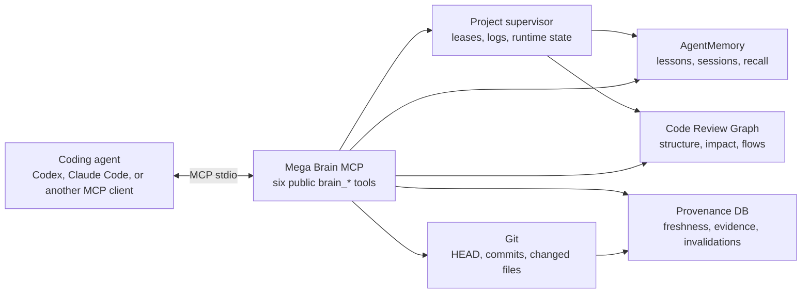
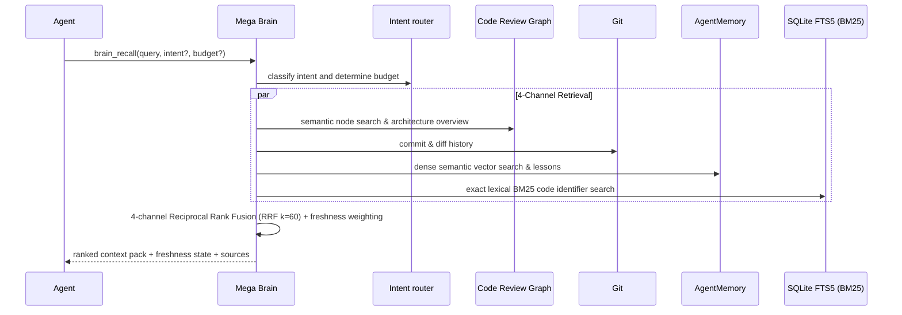
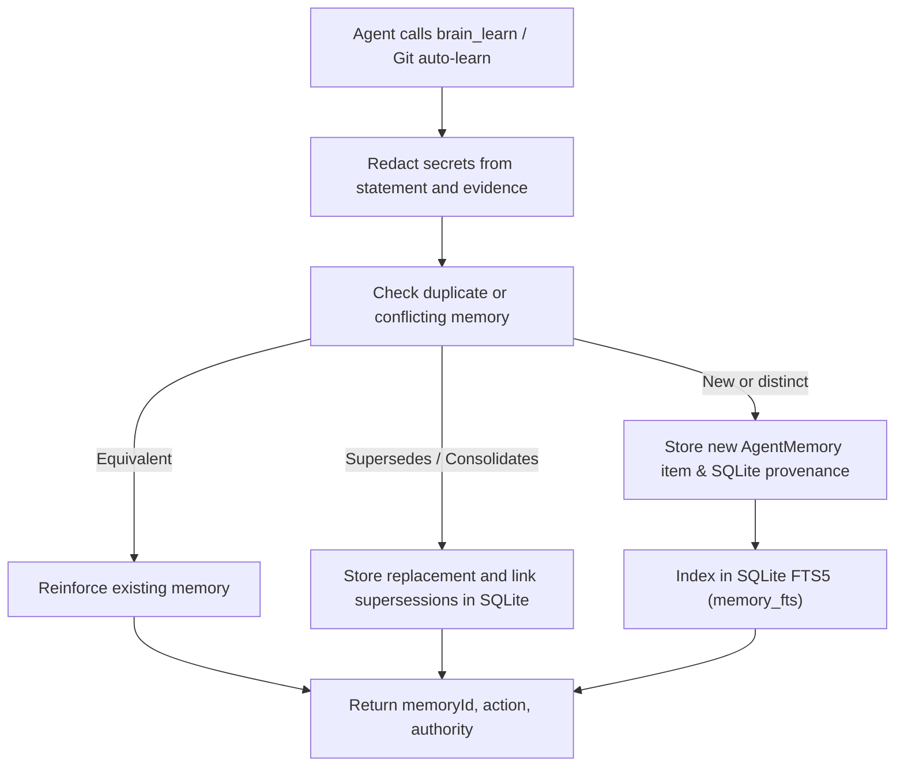
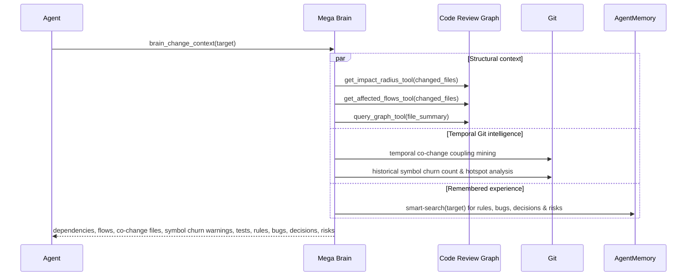
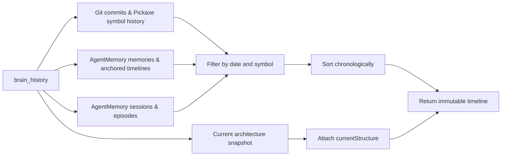
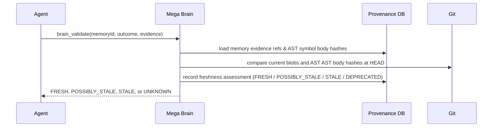
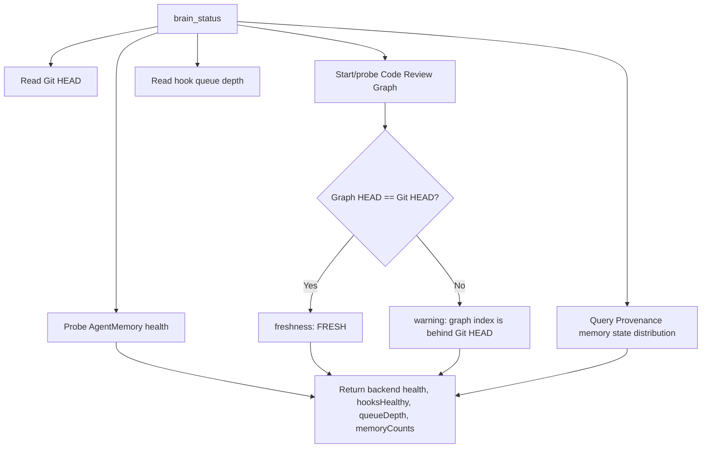
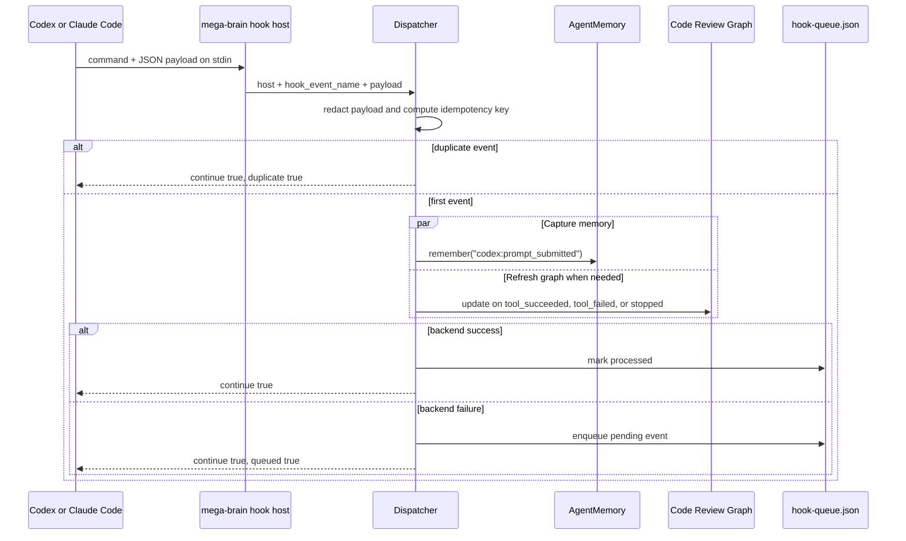
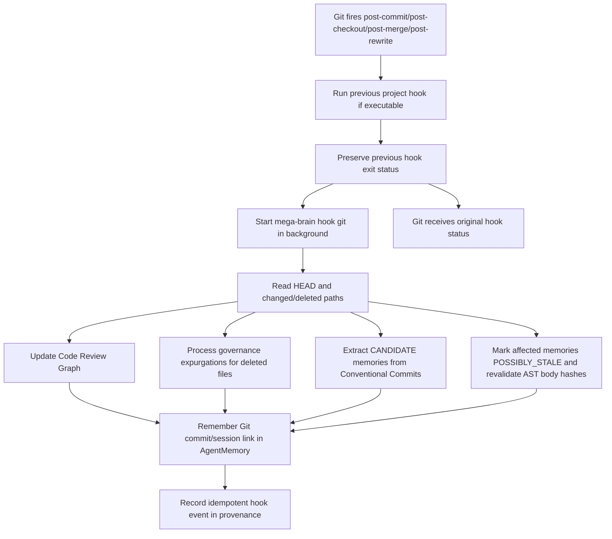
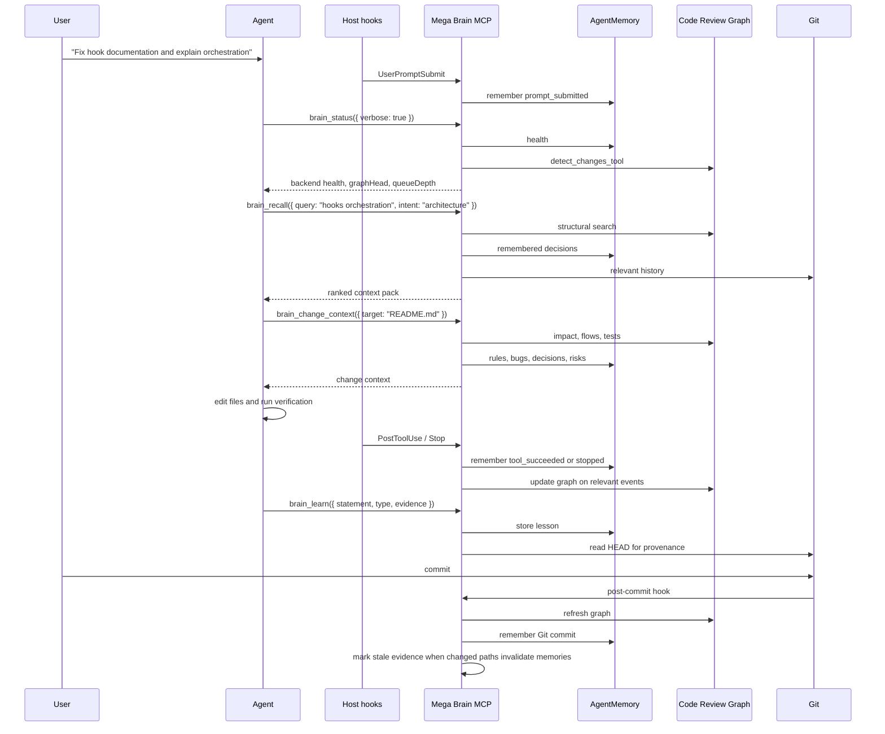

# Mega Brain MCP

Mega Brain MCP is a local-first knowledge control plane for software projects. It exposes six stable MCP tools while keeping AgentMemory, Code Review Graph, and Git behind versioned private adapters.

The public MCP surface is exactly `brain_recall`, `brain_learn`, `brain_change_context`, `brain_history`, `brain_validate`, and `brain_status`.

### Repo activity


> [!NOTE]
> Agents talk to one Mega Brain MCP server. They do not call AgentMemory or Code Review Graph directly. Mega Brain owns routing, provenance, freshness, hooks, queueing, and backend isolation.

## Contents

- [Requirements](#requirements)
- [Install the package](#install-the-package)
- [Set up one project](#set-up-one-project)
- [What gets installed per project](#what-gets-installed-per-project)
- [Runtime architecture](#runtime-architecture)
- [MCP tools](#mcp-tools)
- [Hooks](#hooks)
- [Example agent session](#example-agent-session)
- [Use and verify](#use-and-verify)
- [Configuration precedence](#configuration-precedence)
- [Development and isolated release gates](#development-and-isolated-release-gates)

## Requirements

- Node.js `>=22.22.0` (certified on 22.22.0 and 24.19.0)
- Python `>=3.10` with `venv` and `ensurepip`
- Git executable for Git-backed evidence, history, and hook installation
- Windows, Ubuntu, or WSL

A directory does not need to be initialized as a Git repository just to start the CLI. When `.git` is absent, Mega Brain derives a stable directory identity, configures MCP/runtime pieces that do not require Git, and reports Git-backed hooks, history, and commit evidence as unavailable until the project is initialized.

`mega-brain setup` checks required runtime prerequisites before it creates runtime files, downloads backends, or changes host configuration. Missing Git is reported as unavailable rather than blocking startup. Managed mode then installs the default managed AgentMemory, Code Review Graph, and Windows iii-engine versions, unless overridden by `MEGA_BRAIN_AGENTMEMORY_VERSION`, `MEGA_BRAIN_CODE_REVIEW_GRAPH_VERSION`, or `MEGA_BRAIN_III_ENGINE_VERSION`, into a project-isolated runtime; global backend installations are not required.

## Install the package

Install the CLI once on the machine:

```powershell
npm install --global @raffahr/mega-brain-mcp
```

Then run project setup separately in every repository or worktree that should use
Mega Brain. The global npm package only provides the `mega-brain` command; it
does not create project runtime files, host MCP entries, hooks, AgentMemory data,
or Code Review Graph data by itself.

For local package-boundary testing before a release, build and install the same
tarball shape that npm publishes:

```powershell
npm ci
npm pack
npm install --global .\raffahr-mega-brain-mcp-0.1.7.tgz
mega-brain --help
```

`npm link` is not required.

## Set up one project

From inside the repository, or by passing `--repo`, run the guided setup. It
validates Node, Python, Git and platform support before the final confirmation.
If validation fails or you cancel before confirmation, it does not create files,
download backends or leave processes running.

```powershell
mega-brain setup --repo .
```

The default setup creates a managed local runtime for that project only. It
configures the selected host to start Mega Brain through MCP `stdio` with an absolute project path so the host can launch from any working directory:

```text
mega-brain mcp --repo <absolute-project-root>
```

When you are already in the project directory, the relative form is valid too:

```powershell
mega-brain mcp --repo .
```

No manual `mega-brain start` or `mega-brain serve` is needed for normal Codex or
Claude Code use. The `mcp` command keeps `stdout` reserved for MCP JSON-RPC messages. Lifecycle diagnostics are written to `stderr` only when `MEGA_BRAIN_LOG_LEVEL=debug` or `MEGA_BRAIN_DEBUG=1` is set.

To install into an already configured project without rerunning the full setup,
use `install`. It opens the same host picker used by setup; choose Codex, Claude
Code, or both:

```powershell
mega-brain setup --repo .
```

On Windows, managed AgentMemory also requires explicit acceptance of the pinned,
checksummed iii-engine artifact in the project runtime:

```powershell
mega-brain setup --repo .
```

The interactive setup asks for this confirmation directly.

## What gets installed per project

Each configured project gets its own identity and runtime namespace. The
namespace is derived from repository, checkout and worktree identity, so two
clones or worktrees do not share data or backend processes by accident.

Project-local configuration is written to:

- `.mega-brain/config.json`

Host integration files are merged, not replaced:

- Codex MCP entry: `.codex/config.toml`
- Codex lifecycle hooks: `.codex/hooks.json`
- Claude Code MCP entry: `.mcp.json`
- Claude Code lifecycle hooks: `.claude/settings.local.json`
- Git hook multiplexer: isolated `core.hooksPath` when the project is a Git repository

Existing MCP servers and hooks remain in place. The installer snapshots the
original bytes under the project's isolated Mega Brain data directory, so
`uninstall` can restore them later. The host sees only the public Mega Brain MCP
server; AgentMemory and Code Review Graph remain private adapters and should not
be added as separate host MCPs.

Runtime files live outside the repository by default under:

```text
<MEGA_BRAIN_DATA_DIR>/projects/<worktreeId>/
```

Inside that namespace Mega Brain stores the runtime lock, logs, integration
backups, provenance database, backend data and IPC state. In managed mode each
project also receives:

- isolated AgentMemory data
- isolated iii-engine files on Windows
- isolated Code Review Graph data
- four loopback AgentMemory ports: REST, streams, viewer and engine
- a private supervisor with leases for concurrent Codex or Claude sessions

After installation, approve the project MCP/hooks when Codex (`/mcp`, `/hooks`) or Claude Code (`/mcp`) asks for project trust.

## Runtime architecture

Mega Brain installs one public MCP endpoint per project and keeps all implementation backends private. The selected coding agent starts Mega Brain through MCP `stdio`; Mega Brain starts or connects to AgentMemory and Code Review Graph using the project identity selected by `--repo`.



Every tool response is wrapped in the same envelope:

```json
{
  "schemaVersion": "1.0",
  "status": "ok",
  "project": "<worktreeId>",
  "head": "<git-head-or-NO_GIT_HEAD>",
  "confidence": 0.9,
  "freshness": "FRESH",
  "sources": [
    { "kind": "agentmemory", "reference": "memory-id", "authority": 0.8 }
  ],
  "warnings": [],
  "result": {}
}
```

The envelope lets an agent distinguish current structural evidence, remembered experience, degraded backend state, and possibly stale knowledge without learning backend-specific APIs.

## MCP tools

The host sees exactly six tools. Backend tools are private implementation details and are intentionally hidden from the agent.

| Tool | Main use | Reads | Writes |
| --- | --- | --- | --- |
| `brain_recall` | Retrieve 4-channel ranked context (RRF k=60) with dense vectors, AST nodes, Git logs, and SQLite FTS5 BM25 lexical matches. Injects architectural overview on architectural queries. | AgentMemory, Code Review Graph, Git, SQLite FTS5 | No |
| `brain_learn` | Store a lesson, rule, decision, bug, or experience with verifiable commit/blob/symbol evidence. Supports deterministic consolidation and supersessions without vector pollution. | AgentMemory, provenance | AgentMemory, provenance |
| `brain_change_context` | Explain what may be affected before changing a file or symbol. Evaluates impact radius, flow paths, temporal co-change coupling, symbol churn, and remembered risk hotspots. | Code Review Graph, AgentMemory, Git history | No |
| `brain_history` | Build a chronological timeline from commits, sessions, memories, anchored AgentMemory episodes, and Git Pickaxe (`git log -S`) symbol evolution. | Git, AgentMemory, Code Review Graph | No |
| `brain_validate` | Reassess whether a remembered item is still fresh against local blob/AST symbol body hashes and batch-reconcile stale candidates. | Provenance, Git | Validation metadata |
| `brain_status` | Report backend health, graph synchronization, hook queue depth, and memory counts across states (`FRESH`, `ACTIVE`, `CANDIDATE`, `POSSIBLY_STALE`, `STALE`, `CONFLICT`, `DEPRECATED`). | Runtime state, AgentMemory, Code Review Graph, Git, Provenance | No |

### `brain_recall`

Use `brain_recall` before implementation, debugging, architectural questions, or any task where prior project decisions matter. It executes a 4-channel Reciprocal Rank Fusion (RRF $k=60$) across dense vector embeddings (AgentMemory), structural AST nodes (Code Review Graph), commit history (Git), and local exact lexical indexing (SQLite FTS5 BM25). In addition, queries with `intent: "architecture"` automatically inject Code Review Graph's native architecture overview.

Input:

```json
{
  "query": "How does the checkout flow publish domain events?",
  "intent": "architecture",
  "budget": "NORMAL"
}
```

Optional `intent` values are `implementation`, `impact`, `history`, `decision`, `procedure`, `architecture`, `workflow`, and `debugging`. Optional `budget` values are `FAST`, `NORMAL`, and `DEEP`.

Flow:



Example JSON-RPC call:

```json
{
  "jsonrpc": "2.0",
  "id": 10,
  "method": "tools/call",
  "params": {
    "name": "brain_recall",
    "arguments": {
      "query": "Where is hook dispatch handled?",
      "intent": "architecture",
      "budget": "FAST"
    }
  }
}
```

### `brain_learn`

Use `brain_learn` when the agent discovers a project rule, a hard-won debugging fact, a decision, or a behavior that should be available in future sessions. Includes secret redaction, deduplication against existing items, deterministic semantic consolidation, and verifiable provenance tracking linked to commits, blobs, and AST symbol hashes.

Input:

```json
{
  "statement": "Codex and Claude host hooks use one dispatcher command; the specific lifecycle event comes from the hook payload.",
  "type": "architecture",
  "evidence": [
    {
      "path": "src/hooks/events.ts",
      "symbol": "CODEX_HOOK_EVENTS",
      "blobHash": "a1b2c3d...",
      "commitHash": "9d2d805..."
    }
  ]
}
```

Optional `type` values are `fact`, `decision`, `architecture`, `procedure`, `bug`, `rule`, `preference`, and `experience`. Evidence can include `path`, `symbol`, `blobHash`, `commitHash`, and `astBodyHash`. When evidence hashes are present, Mega Brain continuously reassesses freshness against Git changes.

Flow:



Example JSON-RPC call:

```json
{
  "jsonrpc": "2.0",
  "id": 11,
  "method": "tools/call",
  "params": {
    "name": "brain_learn",
    "arguments": {
      "statement": "Run brain_status before relying on graph freshness after a checkout.",
      "type": "procedure",
      "evidence": [
        { "path": "src/tools/brain-status.ts" }
      ]
    }
  }
}
```

### `brain_change_context`

Use `brain_change_context` before editing a file, package, route, model, or feature boundary. It combines current Code Review Graph impact radius and affected flows with temporal co-change coupling from Git history, symbol churn frequency, and remembered risk hotspots from AgentMemory.

Input:

```json
{
  "target": "src/cli/hook.ts",
  "budget": "NORMAL"
}
```

Flow:



Example JSON-RPC call:

```json
{
  "jsonrpc": "2.0",
  "id": 12,
  "method": "tools/call",
  "params": {
    "name": "brain_change_context",
    "arguments": {
      "target": "src/server/application.ts",
      "budget": "DEEP"
    }
  }
}
```

### `brain_history`

Use `brain_history` when the agent needs chronological intelligence: when a behavior changed, what sessions touched a topic, anchored timeline episodes around bugs/decisions, or how a specific symbol evolved over time via Git Pickaxe (`git log -S`).

Input:

```json
{
  "query": "host hooks",
  "limit": 10,
  "start": "2026-08-01T00:00:00.000Z",
  "end": "2026-08-31T23:59:59.999Z"
}
```

`limit` must be between 1 and 100. `start` and `end` are ISO datetimes.

Flow:



Example JSON-RPC call:

```json
{
  "jsonrpc": "2.0",
  "id": 13,
  "method": "tools/call",
  "params": {
    "name": "brain_history",
    "arguments": {
      "query": "hook installation",
      "limit": 20
    }
  }
}
```

### `brain_validate`

Use `brain_validate` when an agent is about to rely on a specific memory and wants to verify whether its local code evidence is still fresh. Validates blob SHA-256 and AST symbol body hashes against Git HEAD, automatically batch-reconciling `POSSIBLY_STALE` candidates back to `FRESH` (if unchanged) or transitioning them to `STALE`.

Input:

```json
{
  "memoryId": "mem_123",
  "outcome": "confirmed",
  "evidence": ["HEAD", "src/hooks/events.ts"]
}
```

Flow:



Example JSON-RPC call:

```json
{
  "jsonrpc": "2.0",
  "id": 14,
  "method": "tools/call",
  "params": {
    "name": "brain_validate",
    "arguments": {
      "memoryId": "mem_123",
      "outcome": "confirmed",
      "evidence": ["src/hooks/events.ts"]
    }
  }
}
```

### `brain_status`

Use `brain_status` at the start of a session, after a checkout, when recall seems stale, or before trusting Code Review Graph impact output. Reports backend health, graph synchronization, hook queue depth, and memory counts across states (`FRESH`, `ACTIVE`, `CANDIDATE`, `POSSIBLY_STALE`, `STALE`, `CONFLICT`, `DEPRECATED`).

Input:

```json
{
  "verbose": true
}
```

Flow:



Example JSON-RPC call:

```json
{
  "jsonrpc": "2.0",
  "id": 15,
  "method": "tools/call",
  "params": {
    "name": "brain_status",
    "arguments": {
      "verbose": true
    }
  }
}
```

## Hooks

Mega Brain uses hooks to keep project knowledge current when the coding agent acts and when Git changes. Hooks are fail-open: Mega Brain failures are captured or queued, but they do not block the host or replace the status of an existing Git hook.

### Host lifecycle hooks

Codex and Claude Code use the same design: every registered event runs one dispatcher command, and the host passes the actual lifecycle event in the hook payload.

| Host | File | Events | Command shape |
| --- | --- | --- | --- |
| Codex | `.codex/hooks.json` | `SessionStart`, `UserPromptSubmit`, `PreToolUse`, `PostToolUse`, `PreCompact`, `Stop` | `mega-brain hook host codex` |
| Claude Code | `.claude/settings.local.json` | `Notification`, `PostToolUse`, `PostToolUseFailure`, `PreCompact`, `PreToolUse`, `SessionEnd`, `SessionStart`, `Stop`, `SubagentStart`, `SubagentStop`, `TaskCompleted`, `UserPromptSubmit` | `mega-brain hook host claude` |

The generated command can be an absolute Node invocation instead of `mega-brain` directly. That is intentional: it avoids depending on a shell `PATH` when the host starts hooks from a different working directory.

Host hook flow:



Canonical event mapping:

| Raw host event | Canonical event |
| --- | --- |
| `Notification` | `notification` |
| `SessionStart` | `session_started` |
| `SessionEnd` | `session_ended` |
| `UserPromptSubmit` | `prompt_submitted` |
| `PreToolUse` | `before_tool` |
| `PostToolUse` | `tool_succeeded` |
| `PostToolUseFailure` | `tool_failed` |
| `PreCompact` | `before_compaction` |
| `Stop` | `stopped` |
| `SubagentStart` | `subagent_started` |
| `SubagentStop` | `subagent_stopped` |
| `TaskCompleted` | `task_completed` |

### Git hook multiplexer

When the project is a Git repository, Mega Brain installs an isolated `core.hooksPath` that contains four managed hooks.

| Git hook | Why Mega Brain listens |
| --- | --- |
| `post-commit` | Link new commits to remembered session context, refresh graph state, extract `CANDIDATE` memories from Conventional Commits, and run `governanceDelete` expurgations for deleted files. |
| `post-checkout` | Detect branch/worktree movement, mark affected memories as `POSSIBLY_STALE`, and trigger proactive AST body hash freshness revalidation. |
| `post-merge` | Refresh graph, run governance expurgations for deleted files, and evaluate freshness after upstream changes arrive. |
| `post-rewrite` | Handle rebases/amends where commit identities change. |

The generated script first runs the previously configured hook, preserves that hook's exit status, then starts Mega Brain in the background:

```sh
previous_status=0
if [ -x '<previous-hooks-path>/<event>' ]; then
  '<previous-hooks-path>/<event>' "$@"
  previous_status=$?
fi
( mega-brain hook git '<event>' "$@" >/dev/null 2>&1 || true ) &
exit "$previous_status"
```

Git hook flow:



### Queueing and retries

If AgentMemory, Code Review Graph, or provenance work fails during hook handling, Mega Brain writes the event to the project queue:

```text
<MEGA_BRAIN_DATA_DIR>/projects/<worktreeId>/hook-queue.json
```

`brain_status` reports the queue depth. A non-zero queue means the agent should treat recent hook-derived context as potentially incomplete until the backend issue is fixed and the queued events are processed by a later runtime path.

## Example agent session

This is the intended flow for a coding agent connected through MCP, regardless of whether the host is Codex, Claude Code, or another MCP-capable coding environment.



Minimal MCP handshake and tool use:

```json
{ "jsonrpc": "2.0", "id": 1, "method": "initialize", "params": { "protocolVersion": "2024-11-05", "capabilities": {}, "clientInfo": { "name": "example-agent", "version": "1.0.0" } } }
```

```json
{ "jsonrpc": "2.0", "id": 2, "method": "tools/list", "params": {} }
```

Expected tool names:

```json
[
  "brain_recall",
  "brain_learn",
  "brain_change_context",
  "brain_history",
  "brain_validate",
  "brain_status"
]
```

Example orchestration policy for an agent:

```text
1. Call brain_status at session start or after checkout.
2. Call brain_recall before answering project-specific questions.
3. Call brain_change_context before editing a target.
4. Make the change and run local verification.
5. Call brain_learn for durable lessons, rules, decisions, or bugs.
6. Let host and Git hooks capture lifecycle events and keep graph/memory freshness current.
```

## Use and verify

Reopen the configured Codex or Claude Code project. The first MCP client starts
the private project supervisor and backends automatically; the last client to
disconnect releases its lease and the runtime shuts down after the grace period.
No manual `start` or `serve` is needed.

Use `doctor` to inspect the effective project identity, paths, ports, backend health, logs, and Git availability. It prints a formatted terminal report by default; pass `--json` when automation needs the raw envelope:

```powershell
mega-brain doctor --repo .
mega-brain doctor --repo . --json
```

`upgrade`, and `uninstall` render live progress checks and final component tables by default. Use `mega-brain upgrade --json` or `mega-brain uninstall --json` only when a script needs the raw structured envelope.


`start`, `stop`, and `serve` remain available as advanced
diagnostic and compatibility commands.

## Managed local AgentMemory

Managed mode is the default. Mega Brain installs and starts the default managed
AgentMemory runtime for the selected project, installs the default managed Code
Review Graph package, and on Windows downloads the default managed iii-engine
artifact into the same isolated runtime namespace. Those defaults are defined in
Mega Brain and can be overridden per install, setup, or upgrade with
`MEGA_BRAIN_AGENTMEMORY_VERSION`, `MEGA_BRAIN_CODE_REVIEW_GRAPH_VERSION`, and
`MEGA_BRAIN_III_ENGINE_VERSION`.

Managed mode does not require a global AgentMemory install. Backend settings are
passed only to the child runtime. Secrets and provider keys must come from the
process environment or an uncommitted `.env`; they are not written to
`.mega-brain/config.json`, runtime locks, host files, logs or setup summaries.

Expensive or external features stay off unless explicitly enabled. See
[configuration](docs/configuration.md) for `MEGA_BRAIN_ALLOW_EGRESS`,
`MEGA_BRAIN_ALLOW_LLM` and the AgentMemory environment allowlist.


## Code Review Graph embeddings & providers

During `mega-brain setup`, you can configure Code Review Graph embeddings independently from AgentMemory:

- **Local (default)**: Uses `sentence-transformers` with `all-MiniLM-L6-v2` (via `CRG_EMBEDDING_MODEL`). Completely offline, zero egress.
- **OpenAI / OpenAI-compatible**: Connects to OpenAI or any compatible gateway via `CRG_OPENAI_API_KEY`, `CRG_OPENAI_BASE_URL`, and `CRG_OPENAI_MODEL`. Falls back to `OPENAI_API_KEY` if available and egress is allowed.
- **Voyage AI**: Uses `CRG_VOYAGE_API_KEY` (or `VOYAGE_API_KEY`) with model `CRG_VOYAGE_MODEL` (default: `voyage-code-3`).
- **Google Gemini**: Uses `CRG_GOOGLE_API_KEY` (or `GOOGLE_API_KEY` / `GEMINI_API_KEY`).
- **MiniMax**: Uses `CRG_MINIMAX_API_KEY` (or `MINIMAX_API_KEY`).

External providers require `MEGA_BRAIN_ALLOW_EGRESS=true`. When egress is authorized, `CRG_ACCEPT_CLOUD_EMBEDDINGS="1"` is automatically injected into the CRG child process. Setup automatically ensures `.mega-brain/` and `.env` are added to the repository's `.gitignore`.

## Use an existing remote AgentMemory

Remote mode does not install or start AgentMemory locally. During
`mega-brain setup`, paste the actual AgentMemory secret token when prompted.
Do not pass the name of a shell variable that contains the token. Mega Brain
validates that token and stores it for this repository only in the repository's
uncommitted `.mega-brain/config.json`.

For scripted installs outside the interactive setup, `install` can read the
same token value from `MEGA_BRAIN_AGENTMEMORY_TOKEN` or from that local config
file:

```powershell
$env:MEGA_BRAIN_AGENTMEMORY_MODE = 'remote'
$env:MEGA_BRAIN_AGENTMEMORY_URL = 'https://memory.example.com'
$env:MEGA_BRAIN_AGENTMEMORY_TOKEN = '<secret>'
mega-brain setup --repo .
```

In remote mode Mega Brain persists the remote URL and token only in the selected
repository's local `.mega-brain/config.json`. The token is used only when this
repository talks to the configured remote AgentMemory service. It is not written
to host MCP files, hook files, runtime locks, logs or setup summaries. Mega
Brain does not install AgentMemory, start AgentMemory or install iii-engine
locally. Code Review Graph and provenance still remain isolated per project.

Before any file or download is created, install performs a reversible namespace
A/B probe and confirms cleanup. If validation fails, fix URL/secret and rerun;
interactive setup stays on that step and also allows switching to managed mode.

No provider key, external egress, or paid LLM is enabled by default.

## Upgrade and uninstall

```powershell
mega-brain upgrade --repo .
mega-brain uninstall --repo .
```

Normal uninstall removes the managed runtime and restores MCP/hooks while preserving project knowledge. Purge is explicit:

```powershell
mega-brain uninstall --repo . --purge
```

Upgrade, stop, and uninstall are safe to repeat.

## Configuration precedence

All commands resolve configuration for the repository selected by `--repo`. The
same resolver is used by `setup`, `mcp`, `serve`, `doctor`, `upgrade`
and `uninstall`.

Precedence is:

1. CLI flags
2. process environment
3. repository `.env`
4. `--config` file or `.mega-brain/config.json`
5. built-in defaults

Relative paths such as `MEGA_BRAIN_DATA_DIR=.mega-brain-runtime` are resolved
against the selected repository root, not the shell's accidental current
directory. `MEGA_BRAIN_PORT` applies only to the explicit HTTP transport; the
default host lifecycle uses `stdio`.

## Development and isolated release gates

```powershell
npm ci
npm run typecheck
npm run build
npm test
npm run benchmark
npm run test:spec
npm run audit
npm run test:isolated
npm pack --dry-run
```

`test:isolated` builds the tarball and uses disposable Docker containers to prove supported installation plus rejection of old Node, missing or pre-3.10 Python, and Python without `venv`, before any project mutation.

## Contributing

Contributions are welcome! Please read [CONTRIBUTING.md](CONTRIBUTING.md) for details on our code of conduct, development setup, testing guidelines, and the process for submitting pull requests.

### We couldn't have done this without you.

<a href="https://github.com/RaffaHr/mega-brain-mcp/graphs/contributors">
  
</a>

## License

Apache-2.0. The installed backends remain governed by their own licenses.
